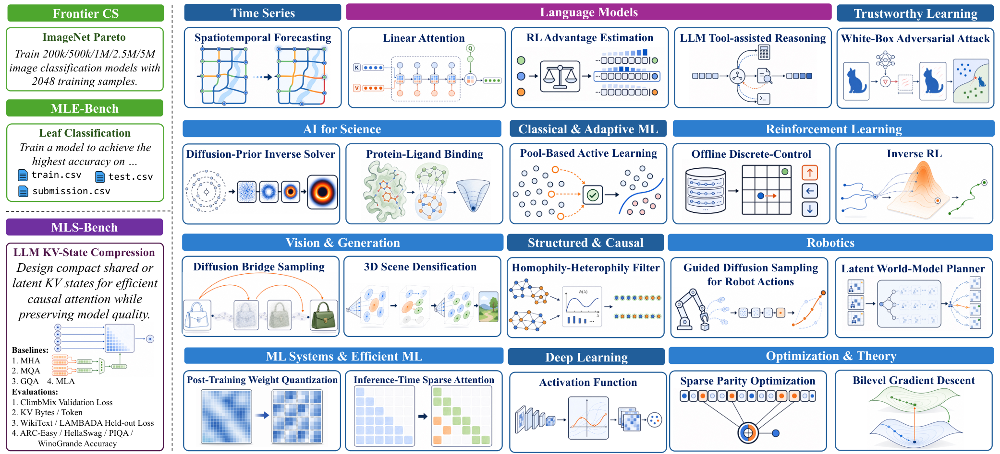

<div align="center">

<h1 align="center">MLS-Bench</h1>

[](https://mls-bench.com)
[](https://arxiv.org/abs/2605.08678)
[](https://huggingface.co/datasets/Bohan22/MLS-Bench-Tasks)
[](https://hub.docker.com/u/bohanlyu2022)
[](https://discord.gg/EsxaCZpSAu)

**MLS-Bench** is a benchmark for **machine learning science**. Where most agent benchmarks reward engineering one fixed instance — clean the data, tune the pipeline, climb a leaderboard — MLS-Bench asks the harder question: can an AI agent propose a new component, loss, optimizer, or training procedure whose gain transfers across settings, seeds, datasets, and scales?

<p align="center">
  
</p>

</div>

The benchmark contains **140 tasks across 12 ML research domains**. Each task fixes a research scaffold, gives the agent the relevant source code and strong baseline implementations, then asks for one algorithmic change inside a constrained edit surface.

## Installation

```bash
pip install -e ".[agent]"
```

Python 3.10+ is required. MLS-Bench separates the choice of **runtime
backend** from the choice of **job scheduler**, and any combination of the
two is supported:

- **Runtime backends**: Docker, Apptainer, or local Conda — selected in
  your config file via `container_runtime`.
- **Job schedulers**: SLURM (when a `slurm:` section is present in the
  config) or the built-in single-node GPU scheduler.

```yaml
container_runtime: docker      # docker, apptainer, or local
```

**Recommended setup**: Docker or Apptainer for the runtime, with SLURM as
the job scheduler. If SLURM is unavailable, the built-in scheduler can be
combined with any of the three runtimes. If neither a container runtime
nor SLURM is available, the local Conda backend together with the built-in
scheduler provides a complete fallback (see the section below).

<details>
<summary><strong>Running with local Conda environments and the built-in scheduler</strong></summary>

When neither Docker nor Apptainer is available, MLS-Bench can build a
dedicated Conda environment per package and dispatch jobs through a
single-node GPU queue (`src/mlsbench/scheduler.py`). This backend is
intended for development and small-scale experimentation; for full-scale
benchmarking on a cluster we recommend SLURM with one of the container
runtimes instead. The Conda backend should not be combined with SLURM,
since both attempt to schedule GPU jobs.

1. Use a config with `container_runtime: local` and no `slurm:` section.
   Throughout this section we refer to it as `configs/local.yaml`.

2. Build the environment for each package:

   ```bash
   mlsbench build <package> --config configs/local.yaml
   ```

3. Start the GPU scheduler:

   ```bash
   nohup python -m mlsbench.scheduler start \
     --gpus 0,1,2,3 \
     --config configs/local.yaml \
     > .scheduler/scheduler.log 2>&1 &
   ```

4. Launch agents or baselines. They enqueue jobs to the scheduler and
   return immediately:

   ```bash
   PYTHONPATH=src nohup python3 -m mlsbench agent <task> --model <model> \
     --config configs/local.yaml \
     > .scheduler/logs/agent_<task>.log 2>&1 &
   ```

5. Inspect or manage the queue:

   ```bash
   python -m mlsbench.scheduler status
   python -m mlsbench.scheduler list
   python -m mlsbench.scheduler cancel <job_id>
   python -m mlsbench.scheduler clear
   ```

To rebuild a package's environment from scratch, remove it with
`conda env remove -n mlsbench-<package>` and re-run `mlsbench build`.

</details>

## API Keys

Running an agent requires an API key for the model provider you choose. If
you enable the optional web-search tool, a Tavily key is also required.
Configure keys in either of two equivalent ways:

**1. Inline in your config file** under the `providers:` block — useful when
you want to keep separate configs per environment or per project:

```yaml
providers:
  openai:
    api_key: "sk-..."
  anthropic:
    api_key: "sk-ant-..."
  openrouter:
    api_key: "sk-or-..."
    base_url: "https://openrouter.ai/api/v1"
  deepseek:
    api_key: "sk-..."
    base_url: "https://api.deepseek.com/v1"
  tavily:
    api_key: "tvly-..."     # only needed if the web_search tool is enabled
```

**2. Environment variables** — leave the `api_key` field empty (or omit the
provider entirely) and the CLI falls back to the standard env var for that
provider:

| Provider | Env var |
| --- | --- |
| OpenAI | `OPENAI_API_KEY` |
| Anthropic | `ANTHROPIC_API_KEY` |
| OpenRouter | `OPENROUTER_API_KEY_NEW` |
| DeepSeek | `DEEPSEEK_API_KEY` |
| Qwen / DashScope | `QWEN_API_KEY` / `DASHSCOPE_API_KEY` |
| Gemini / Google | `GEMINI_API_KEY` / `GOOGLE_API_KEY` |
| Kimi / Moonshot | `KIMI_API_KEY` / `MOONSHOT_API_KEY` |
| GLM | `GLM_API_KEY` |
| MiniMax | `MINIMAX_API_KEY` |
| Tavily (web search) | `TAVILY_API_KEY` |

You can also use `${ENV_VAR}` interpolation inside the YAML
(`api_key: "${OPENAI_API_KEY}"`) when you want a tracked config file that
still resolves the secret from the environment at runtime.

The model string passed to `mlsbench agent --model <name>` selects the
provider automatically:

- **Bare names** are dispatched by their well-known prefix:
  `claude-*` → `providers.anthropic`,
  `gpt-* / o1 / o3 / o4` → `providers.openai`,
  `deepseek-*` → `providers.deepseek`,
  `qwen-*` → `providers.qwen`,
  `gemini-*` → `providers.gemini`,
  `kimi-* / moonshot-*` → `providers.kimi`,
  `glm-*` → `providers.glm`,
  `minimax-*` → `providers.minimax`.
- **Prefixed names** (`<provider>/<model>`, e.g. `openai/gpt-5.4`,
  `vertex_ai/...`, `openrouter/anthropic/claude-opus-4.6`) dispatch
  generically to the matching `providers.<provider>` entry. Point that
  entry's `base_url` at whichever upstream you want — direct API,
  OpenRouter, a LiteLLM proxy, etc. — and the same key is reused.

## Quick Start

Fetch external packages and build the runtime (data dependencies are
prepared automatically as part of the build):

```bash
mlsbench fetch --name <package>
mlsbench build <package> --config configs/react.yaml
```

Run an agent and compute its task score:

```bash
mlsbench agent <task> --model <model> --config configs/react.yaml
mlsbench score task <task>
```

Baseline scores are already populated in each task's `leaderboard.csv`, so
running an agent alone is sufficient to obtain its normalized score under
the MLS-Bench evaluation framework. Before launching the agent, however, we
recommend running one baseline first to confirm that your environment is
set up correctly:

```bash
mlsbench baseline <task> --name <baseline> --config configs/react.yaml
```

Baselines and agents share the same task scripts, parsers, seeds, resource
limits, and leaderboard code; only the source of the edits differs.

## Prebuilt Container Images

To avoid building each package from source, prebuilt images are published
for every supported package:

- **Docker Hub**: `bohanlyu2022/mlsbench-<pkg>:latest` —
  <https://hub.docker.com/u/bohanlyu2022>
- **Hugging Face (Apptainer SIFs)**: `sif/<Pkg>.sif` inside the
  [Bohan22/MLS-Bench-Tasks](https://huggingface.co/datasets/Bohan22/MLS-Bench-Tasks)
  dataset

`mlsbench agent`, `mlsbench baseline`, and `mlsbench build` automatically
pull the prebuilt image when the local image is missing, and fall back to
building from source on failure. `mlsbench run` performs the same lookup
but does not build from source; run `mlsbench build <pkg>` first if a
local build is required.

Two mutually-exclusive flags force a specific source for `mlsbench build`:

```bash
mlsbench build <package> --pull          # use only the prebuilt image
mlsbench build <package> --local-build   # build locally from the Dockerfile / .def
```

For Apptainer, the SIF can be obtained either via `apptainer pull
docker://...` (default) or from the Hugging Face mirror — a direct HTTPS
download of `sif/<Pkg>.sif`, which can be faster in networks where Docker
registries are slow. Select the source with `--sif-source {docker,hf,auto}`
on `mlsbench build`.

## Running under Harbor

MLS-Bench's 140 tasks are also available as a [Harbor](https://github.com/harbor-framework/harbor)
dataset so any Harbor-supported agent (`claude-code`, `codex`, `openhands`,
`terminus-2`, …) can be evaluated on the suite without going through this
repository's own runner:

```bash
PYTHONPATH=. harbor run -c run.yaml -a claude-code -m anthropic/claude-opus-4-1
```

The pre-rendered dataset, GPU-capable environment plugin, and reference
Harbor config live under [`harbor/`](harbor/). See
[`harbor/README.md`](harbor/README.md) for usage details and the
self-contained per-task layout.

## Repository Map

```text
src/mlsbench/                  CLI, agent loop, execution backends, scoring
tasks/<task>/                  140 task definitions, parsers, scores, baselines
vendor/packages.yaml           External package registry
vendor/pkg_configs/<package>/  Package runtime configs and pre-edit patches
vendor/data_scripts/           Dataset and model-cache preparation scripts
configs/react.yaml             Runtime and provider configuration
configs/openevolve.yaml        OpenEvolve defaults
configs/discover.yaml          Discover defaults
harbor/                        Pre-rendered Harbor dataset (140 tasks) + run config
```

Fetched upstream repositories, built images, downloaded datasets, run workspaces, logs, and scheduler state are intentionally not versioned.

## Full Task Catalog

<details>
<summary><strong>Show the 140-task appendix table</strong></summary>

| Area | Directory shorthand | Task | Research question | External package(s) | Baselines | Evaluation settings |
| --- | --- | --- | --- | --- | --- | --- |
| LM | [agent-tool-reasoning](tasks/agent-tool-reasoning) | LLM Agent Tool-Use Reasoning Strategy | Studies how tool-use search, backtracking, and stopping policies affect answer validity and query efficiency. | [zhichengg/StableToolBench](https://github.com/zhichengg/StableToolBench) | Greedy Chain (CoT)<br>DFS with LLM Ranking<br>DFSDT | StableToolBench I1-instruction 50q / deepseek-chat<br>StableToolBench I1-instruction 50q / qwen2.5-72b-instruct<br>StableToolBench I1-instruction 50q / qwen2.5-7b-instruct |
| LM | [llm-dllm-demask-strategy](tasks/llm-dllm-demask-strategy) | Masked Diffusion LM: Demasking Strategy | Studies how demasking schedules, position selection, and token assignment affect diffusion language-model quality and decoding efficiency. | [ML-GSAI/LLaDA](https://github.com/ML-GSAI/LLaDA) | Top-K Margin<br>Confidence Greedy<br>KLASS | LLaDA / MATH-500<br>LLaDA / HumanEval<br>Dream / C4 prefix continuation |
| LM | [llm-pretrain-attention](tasks/llm-pretrain-attention) | Autoregressive Attention Mechanism | Studies how self-attention computation and positional handling affect autoregressive pretraining loss and downstream accuracy. | [karpathy/nanoGPT](https://github.com/karpathy/nanoGPT)<br>[EleutherAI/lm-evaluation-harness](https://github.com/EleutherAI/lm-evaluation-harness) | QK-Norm<br>RoPE<br>RoPE + QK-Norm | ClimbMix val loss + WikiText-2/LAMBADA PPL<br>HellaSwag, ARC-Easy, PIQA, WinoGrande 0-shot accuracy |
| LM | [llm-pretrain-bitlinear](tasks/llm-pretrain-bitlinear) | Low-Bit Linear Pretraining Layer | Studies how low-bit linear layers and quantization functions affect pretraining loss under discrete weight constraints. | [karpathy/nanoGPT](https://github.com/karpathy/nanoGPT)<br>[EleutherAI/lm-evaluation-harness](https://github.com/EleutherAI/lm-evaluation-harness) | Binary Sign (BitNet)<br>Ternary 1.58-bit (BitNet b1.58)<br>INT2 Uniform | ClimbMix val loss + WikiText-2/LAMBADA PPL<br>HellaSwag, ARC-Easy, PIQA, WinoGrande 0-shot accuracy |
| LM | [llm-pretrain-embedding](tasks/llm-pretrain-embedding) | Autoregressive Embedding Strategy | Studies how token embeddings, position embeddings, value embeddings, and weight tying affect autoregressive pretraining loss and downstream accuracy. | [karpathy/nanoGPT](https://github.com/karpathy/nanoGPT)<br>[EleutherAI/lm-evaluation-harness](https://github.com/EleutherAI/lm-evaluation-harness) | Untied Embeddings<br>Value Embeddings<br>Bigram Hash Embeddings | ClimbMix val loss + WikiText-2/LAMBADA PPL<br>HellaSwag, ARC-Easy, PIQA, WinoGrande 0-shot accuracy |
| LM | [llm-pretrain-linear-attention](tasks/llm-pretrain-linear-attention) | Subquadratic Attention Mechanism | Studies whether linear or subquadratic attention can reduce autoregressive validation loss while preserving downstream performance. | [karpathy/nanoGPT](https://github.com/karpathy/nanoGPT)<br>[EleutherAI/lm-evaluation-harness](https://github.com/EleutherAI/lm-evaluation-harness) | RetNet<br>DeltaNet<br>GLA | ClimbMix val loss + WikiText-2/LAMBADA PPL<br>HellaSwag, ARC-Easy, PIQA, WinoGrande 0-shot accuracy |
| LM | [llm-pretrain-loss](tasks/llm-pretrain-loss) | Autoregressive Pretraining Loss | Studies how alternative next-token training losses affect autoregressive validation cross-entropy. | [karpathy/nanoGPT](https://github.com/karpathy/nanoGPT)<br>[EleutherAI/lm-evaluation-harness](https://github.com/EleutherAI/lm-evaluation-harness) | Label Smoothing<br>Softcap Cross-Entropy<br>Z-Loss | ClimbMix val loss + WikiText-2/LAMBADA PPL<br>HellaSwag, ARC-Easy, PIQA, WinoGrande 0-shot accuracy |
| LM | [llm-pretrain-lr-schedule](tasks/llm-pretrain-lr-schedule) | Pretraining Learning-Rate Schedule | Studies how warmup, decay shape, and schedule horizon affect autoregressive pretraining validation loss. | [karpathy/nanoGPT](https://github.com/karpathy/nanoGPT)<br>[EleutherAI/lm-evaluation-harness](https://github.com/EleutherAI/lm-evaluation-harness) | WSD (Warmup-Stable-Decay)<br>Trapezoidal<br>WSD with Inverse-Sqrt Decay | ClimbMix val loss + WikiText-2/LAMBADA PPL<br>HellaSwag, ARC-Easy, PIQA, WinoGrande 0-shot accuracy |
| LM | [llm-pretrain-mlp](tasks/llm-pretrain-mlp) | Transformer Feed-Forward Block | Studies how activation, gating, and expansion choices in the feed-forward sublayer affect language-model validation loss. | [karpathy/nanoGPT](https://github.com/karpathy/nanoGPT)<br>[EleutherAI/lm-evaluation-harness](https://github.com/EleutherAI/lm-evaluation-harness) | ReLU-Squared<br>SwiGLU<br>GeGLU | ClimbMix val loss + WikiText-2/LAMBADA PPL<br>HellaSwag, ARC-Easy, PIQA, WinoGrande 0-shot accuracy |
| LM | [llm-pretrain-normalization](tasks/llm-pretrain-normalization) | Normalization and Block Layout | Studies how normalization placement, affine behavior, and transformer block layout affect pretraining stability and validation loss. | [karpathy/nanoGPT](https://github.com/karpathy/nanoGPT)<br>[EleutherAI/lm-evaluation-harness](https://github.com/EleutherAI/lm-evaluation-harness) | RMSNorm<br>RMSNorm + Sandwich-Norm<br>RMSNorm (Parallel Block) | ClimbMix val loss + WikiText-2/LAMBADA PPL<br>HellaSwag, ARC-Easy, PIQA, WinoGrande 0-shot accuracy |
| LM | [llm-pretrain-optimizer](tasks/llm-pretrain-optimizer) | Pretraining Optimizer Design | Studies how optimizer choice, parameter grouping, and schedule coupling affect autoregressive pretraining validation loss. | [karpathy/nanoGPT](https://github.com/karpathy/nanoGPT)<br>[EleutherAI/lm-evaluation-harness](https://github.com/EleutherAI/lm-evaluation-harness) | AdamW + Nesterov<br>Lion<br>Muon | ClimbMix val loss + WikiText-2/LAMBADA PPL<br>HellaSwag, ARC-Easy, PIQA, WinoGrande 0-shot accuracy |
| LM | [llm-pretrain-residual](tasks/llm-pretrain-residual) | Transformer Residual Stream Strategy | Studies how residual connections and information flow across transformer layers affect validation loss, perplexity, and accuracy metrics. | [karpathy/nanoGPT](https://github.com/karpathy/nanoGPT)<br>[EleutherAI/lm-evaluation-harness](https://github.com/EleutherAI/lm-evaluation-harness) | Vanilla (Pre-LN)<br>ProRes<br>Learned Scaling<br>Block Attention Residuals | ClimbMix val loss + WikiText-2/LAMBADA PPL<br>HellaSwag, ARC-Easy, PIQA, WinoGrande 0-shot accuracy |
| LM | [llm-rl-advantage](tasks/llm-rl-advantage) | Reasoning RL Advantage Estimation | Studies how advantage estimates for online language-model reinforcement learning affect mathematical reasoning accuracy. | [volcengine/verl](https://github.com/volcengine/verl) | GRPO<br>Dr. GRPO<br>Reinforce++ Baseline | GSM8K<br>MATH-500<br>AMC |
| LM | [llm-rl-importance-sampling](tasks/llm-rl-importance-sampling) | Reasoning RL Importance-Sampling Granularity | Studies how importance-sampling ratio granularity and clipping affect online language-model reinforcement learning for reasoning. | [volcengine/verl](https://github.com/volcengine/verl) | Token-Level (Vanilla PPO)<br>Sequence-Level (GSPO)<br>First-K Tokens | GSM8K<br>MATH-500<br>AMC |
| LM | [llm-rl-kl-estimator](tasks/llm-rl-kl-estimator) | Actor Divergence Estimator for Reasoning RL | Studies how per-token actor KL estimation controls reference-policy drift while preserving reasoning accuracy during online RL. | [volcengine/verl](https://github.com/volcengine/verl) | K1 (Unbiased Log-Ratio)<br>K2 (Squared Log-Ratio)<br>K3 (Low-Variance KL)<br>Absolute Log-Ratio | GSM8K<br>MATH-500<br>AMC |
| LM | [llm-rl-reward-normalization](tasks/llm-rl-reward-normalization) | Pre-Advantage Reward Normalization | Studies how reward normalization before advantage estimation affects reasoning accuracy in online language-model RL. | [volcengine/verl](https://github.com/volcengine/verl) | Outcome-Only (Raw)<br>Group-Std Normalization<br>Batch-Std Whitening<br>Length-Aware Normalization | GSM8K<br>MATH-500<br>AMC |
| LM | [llm-scaling-law-discovery](tasks/llm-scaling-law-discovery) | Symbolic Scaling-Law Discovery | Studies how symbolic functional forms and group-specific coefficients capture held-out scaling behavior. | [trevorstephens/gplearn](https://github.com/trevorstephens/gplearn) | Human Exact Form<br>SLDAgent-Style<br>Kernel Ridge Regression<br>XGBoost | SLDBench Vocabulary Scaling<br>SLDBench LR x Batch-Size Scaling<br>SLDBench Data-Constrained Scaling |
| LM | [mas-topology](tasks/mas-topology) | Language-Agent Collaboration Topology | Studies how deterministic collaboration topology affects multi-agent code-generation quality and execution success. | [OpenBMB/ChatDev](https://github.com/OpenBMB/ChatDev) | Chain<br>Star<br>Layered | HumanEval-33 (deepseek-chat, 4 agents)<br>HumanEval-33 (qwen2.5-72b-instruct, 4 agents)<br>SRDD-20 (deepseek-chat, 4 agents) |
| Rob | [jepa-planning](tasks/jepa-planning) | Latent World-Model Planner | Studies how goal-conditioned planning should exploit a fixed latent world model to improve navigation success. | [facebookresearch/eb_jepa](https://github.com/facebookresearch/eb_jepa) | Random<br>CEM<br>MPPI<br>iCEM | Two Rooms (Horizon 30)<br>Two Rooms (Horizon 60)<br>Two Rooms (Horizon 90) |
| Rob | [jepa-prediction-loss](tasks/jepa-prediction-loss) | Temporal Latent Prediction Loss | Studies how latent prediction objectives affect multi-step video representation quality. | [facebookresearch/eb_jepa](https://github.com/facebookresearch/eb_jepa) | MSE<br>Smooth L1<br>Cosine | Moving MNIST AP (small: henc=16, dstc=8, hpre=16)<br>Moving MNIST AP (base: henc=32, dstc=16, hpre=32)<br>Moving MNIST AP (large: henc=64, dstc=32, hpre=64) |
| Rob | [jepa-regularizer](tasks/jepa-regularizer) | Anti-Collapse Representation Regularizer | Studies how self-supervised regularization prevents representation collapse and improves linear-probe accuracy. | [facebookresearch/eb_jepa](https://github.com/facebookresearch/eb_jepa) | Naive<br>VICReg<br>SigReg<br>Barlow Twins | ResNet-18 Probe<br>ResNet-34 Probe<br>ResNet-50 Probe |
| Rob | [robo-diffusion-guidance](tasks/robo-diffusion-guidance) | Diffusion Guidance for Robot Trajectory Planning | Studies guidance mechanisms for a fixed trajectory-level diffusion planner on D4RL MuJoCo, optimizing normalized score across hopper-medium-v2, walker2d-medium-v2, and halfcheetah-medium-v2. | [CleanDiffuserTeam/CleanDiffuser](https://github.com/CleanDiffuserTeam/CleanDiffuser) | Diffuser (Classifier Guidance)<br>Classifier-Free Guidance<br>No Guidance<br>Decision Diffuser | D4RL Hopper-Medium-v2<br>D4RL Walker2d-Medium-v2<br>D4RL HalfCheetah-Medium-v2 |
| Rob | [robo-diffusion-policy](tasks/robo-diffusion-policy) | Diffusion Policy Learning for Robot Control | Studies how diffusion policy training, value guidance, and action generation affect robot-control episode reward. | [CleanDiffuserTeam/CleanDiffuser](https://github.com/CleanDiffuserTeam/CleanDiffuser) | DQL (Diffusion Q-Learning)<br>IDQL<br>Diffusion Policy | D4RL Hopper-Medium-v2<br>D4RL Walker2d-Medium-v2<br>D4RL HalfCheetah-Medium-v2 |
| Rob | [robo-diffusion-sampling-method](tasks/robo-diffusion-sampling-method) | Efficient Diffusion Sampling for Robot Actions | Studies how solver choice and sampling_steps affect DQL-style diffusion-policy normalized score at low NFE on D4RL MuJoCo. | [CleanDiffuserTeam/CleanDiffuser](https://github.com/CleanDiffuserTeam/CleanDiffuser) | DDPM (100-Step Ancestral Sampling)<br>DDIM (20-Step Deterministic Sampling)<br>DPM-Solver++ 2M (10-Step) | D4RL Hopper-Medium-v2<br>D4RL Walker2d-Medium-v2<br>D4RL HalfCheetah-Medium-v2 |
| Rob | [robo-humanoid-sim2real-algo](tasks/robo-humanoid-sim2real-algo) | Humanoid Transfer Policy Learning | Studies how actor-critic architecture, policy optimization, and rollout processing affect humanoid command-following transfer. | [roboterax/humanoid-gym](https://github.com/roboterax/humanoid-gym) | Default PPO<br>PPO with Adaptive KL<br>PPO with LayerNorm | RobotEra XBot-L Training<br>RobotEra XBot-L / Diverse Commands<br>RobotEra XBot-L / Forward-Only<br>RobotEra XBot-L / High Speed |
| Rob | [robomimic-bc-loss](tasks/robomimic-bc-loss) | Behavioral Cloning Loss for Manipulation | Studies how imitation-learning loss design affects rollout success for low-dimensional robot manipulation tasks. | [ARISE-Initiative/robomimic](https://github.com/ARISE-Initiative/robomimic) | NLL with Entropy<br>Weighted NLL<br>Default (NLL) | Tool Hang (PH)<br>Can (PH)<br>Square (PH) |
| Rob | [robomimic-iql-vf](tasks/robomimic-iql-vf) | Offline Value Loss for Manipulation | Studies how asymmetric value regression loss design affects offline robot manipulation policy success. | [ARISE-Initiative/robomimic](https://github.com/ARISE-Initiative/robomimic) | Quantile Regression<br>Huber Pinball<br>Default (Expectile) | Tool Hang (PH)<br>Can (PH)<br>Square (PH) |
| Rob | [robomimic-obs-encoder](tasks/robomimic-obs-encoder) | Observation Fusion Encoder for Imitation Learning | Designs a multimodal robot state encoder for behavioral cloning to improve rollout success rate on manipulation tasks. | [ARISE-Initiative/robomimic](https://github.com/ARISE-Initiative/robomimic) | Attention Fusion<br>Gated Fusion<br>Default (Concatenation) | Tool Hang (PH)<br>Can (PH)<br>Square (PH) |
| Rob | [tdmpc2-planning](tasks/tdmpc2-planning) | Trajectory Optimization for Model-Based Planning | An online planning algorithm selects actions through learned-world-model trajectory optimization to improve episode reward. | [nicklashansen/tdmpc2](https://github.com/nicklashansen/tdmpc2) | CEM<br>iCEM<br>MPPI | Walker Walk<br>Cheetah Run<br>Cartpole Swingup |
| Rob | [tdmpc2-simnorm](tasks/tdmpc2-simnorm) | Latent Representation Normalization for Model-Based RL | Designs latent-state normalization for the TD-MPC2 encoder and dynamics world-model networks, evaluated by DMControl episode reward. | [nicklashansen/tdmpc2](https://github.com/nicklashansen/tdmpc2) | SimNorm<br>L2 normalization<br>RMSNorm<br>Identity (no normalization) | DMControl walker-walk<br>DMControl cheetah-run<br>DMControl cartpole-swingup |
| V&G | [cv-3dgs-densification](tasks/cv-3dgs-densification) | 3D Gaussian Splatting Densification Strategy Design | Designs a 3D Gaussian Splatting densification strategy controlling clone, split, prune, reset, relocation, and sample-add behavior to improve held-out novel-view quality on Mip-NeRF 360 scenes. | [nerfstudio-project/gsplat](https://github.com/nerfstudio-project/gsplat) | Original 3DGS densification<br>AbsGS + Taming-3DGS + New Split<br>EDC-TamingGS-Abs | Mip-NeRF 360 garden (8x, best PSNR)<br>Mip-NeRF 360 bicycle (8x, best PSNR)<br>Mip-NeRF 360 bonsai (8x, best PSNR)<br>Mip-NeRF 360 stump (8x, best PSNR) |
| V&G | [cv-3dgs-regularizer](tasks/cv-3dgs-regularizer) | 3D Gaussian Splatting Regularizer Design | Designs a scalar regularizer added to the 3DGS photometric loss during 30k-step Mip-NeRF 360 reconstruction, evaluated on held-out novel views and scored by best PSNR. | [nerfstudio-project/gsplat](https://github.com/nerfstudio-project/gsplat) | No regularization<br>Scale + opacity L1<br>Effective-rank + scale/opacity L1 | Mip-NeRF 360 garden (8x, best PSNR)<br>Mip-NeRF 360 bicycle (8x, best PSNR)<br>Mip-NeRF 360 bonsai (8x, best PSNR)<br>Mip-NeRF 360 stump (8x, best PSNR) |
| V&G | [cv-dbm-sampler](tasks/cv-dbm-sampler) | Custom Sampler for Diffusion Bridge Models | Designs a low-NFE sampler for Diffusion Bridge Models on image-to-image translation, ImageNet center-inpainting, and DIODE depth, evaluated by FID at NFE=5. | [thu-ml/DiffusionBridge](https://github.com/thu-ml/DiffusionBridge) | DBIM<br>DBIM-HO (high-order)<br>DDBM (50 NFE reference)<br>ECSI | Edges2Handbags / e2h (FID, NFE=5)<br>ImageNet center-inpaint (FID, NFE=5)<br>DIODE depth (FID, NFE=5) |
| V&G | [cv-dbm-scheduler](tasks/cv-dbm-scheduler) | Time Scheduler for Diffusion Bridge Models (NFE=5) | Designs a monotone low-step time schedule for Diffusion Bridge Models, evaluated by FID on Edges2Handbags, ImageNet center-inpainting, and DIODE depth at NFE=5. | [thu-ml/DiffusionBridge](https://github.com/thu-ml/DiffusionBridge) | Karras EDM (rho=7)<br>Uniform (linear)<br>Cosine (Nichol-Dhariwal)<br>Log-linear (geometric) | Edges2Handbags / e2h (FID, NFE=5)<br>ImageNet center-inpaint (FID, NFE=5)<br>DIODE depth (FID, NFE=5) |
| V&G | [cv-diffusion-architecture](tasks/cv-diffusion-architecture) | Diffusion Model Architecture Design | Design a denoising UNet backbone for unconditional CIFAR-10 DDPM training, optimizing best FID with fixed epsilon prediction and 50-step DDIM sampling. | [huggingface/diffusers](https://github.com/huggingface/diffusers) | Standard DDPM U-Net<br>Full-Attention U-Net<br>No-Attention U-Net | CIFAR-10 DDPM Small<br>CIFAR-10 DDPM Medium<br>CIFAR-10 DDPM Large |
| V&G | [cv-diffusion-cfg](tasks/cv-diffusion-cfg) | Diffusion Model: Classifier-Free Guidance Optimization | Design a classifier-free guidance method for Stable Diffusion text-to-image generation across SD v1.5, Stable Diffusion 2 Base, and Stable Diffusion XL; evaluation generates COCO-caption images and official scoring uses per-model FID. | [CFGpp-diffusion/CFGpp](https://github.com/CFGpp-diffusion/CFGpp) | Standard CFG<br>CFG++<br>Zero-Init CFG++ | Stable Diffusion v1.5 / COCO captions / NFE=10<br>Stable Diffusion 2 Base / COCO captions / NFE=10<br>Stable Diffusion XL Base 1.0 / COCO captions / NFE=10 |
| V&G | [cv-diffusion-conditioning](tasks/cv-diffusion-conditioning) | Class-Conditional Diffusion: Conditioning Injection Methods | Design class-conditioning injection for a CIFAR-10 class-conditional UNet2DModel/DDPM, optimizing best FID with 50-step DDIM sampling. | [huggingface/diffusers](https://github.com/huggingface/diffusers) | Concat-FiLM<br>Cross-Attention<br>AdaLN-Zero | CIFAR-10 Class-Conditional Small UNet2DModel<br>CIFAR-10 Class-Conditional Medium UNet2DModel<br>CIFAR-10 Class-Conditional Large UNet2DModel |
| V&G | [cv-diffusion-efficiency](tasks/cv-diffusion-efficiency) | Diffusion Model: Sampler Efficiency Optimization | Design a Stable Diffusion sampler update rule for COCO-caption text-to-image generation at a fixed NFE=20 budget; official scoring uses per-model FID. | [CFGpp-diffusion/CFGpp](https://github.com/CFGpp-diffusion/CFGpp) | DDIM<br>DPM++ 3M<br>DPM++ 2S | Stable Diffusion v1.5 / COCO captions / NFE=20<br>Stable Diffusion 2 Base / COCO captions / NFE=20<br>Stable Diffusion XL Base 1.0 / COCO captions / NFE=20 |
| V&G | [cv-diffusion-prediction](tasks/cv-diffusion-prediction) | Diffusion Prediction Parameterization | Design a prediction target and consistent x0 inversion for unconditional CIFAR-10 UNet2DModel diffusion, optimizing best FID with 50-step DDIM sampling. | [huggingface/diffusers](https://github.com/huggingface/diffusers) | Epsilon Prediction<br>V-Prediction<br>X0 Prediction | CIFAR-10 Unconditional Small UNet2DModel<br>CIFAR-10 Unconditional Medium UNet2DModel<br>CIFAR-10 Unconditional Large UNet2DModel |
| V&G | [cv-meanflow-perceptual-loss](tasks/cv-meanflow-perceptual-loss) | Flow Map with Perceptual Loss | Studies whether auxiliary perceptual losses on denoised images improve CIFAR-10 FID for MeanFlow flow-map training with DiT backbones. | [snap-research/alphaflow](https://github.com/snap-research/alphaflow) | Pure MSE Velocity<br>MSE + Charbonnier + LPIPS + Gradient + Multiscale<br>MSE + LPIPS + Gradient + Multiscale + FFT | CIFAR-10 Small DiT<br>CIFAR-10 Medium DiT<br>CIFAR-10 Large DiT |
| V&G | [cv-vae-loss](tasks/cv-vae-loss) | VAE Loss Function Design for Image Reconstruction | Studies how VAE loss components affect CIFAR-10 AutoencoderKL reconstruction quality, scored primarily by rFID on the full test set. | [huggingface/diffusers](https://github.com/huggingface/diffusers) | L1 + KL<br>L1 + LPIPS + KL<br>L1 + LPIPS + KL + PatchGAN | CIFAR-10 AutoencoderKL Small<br>CIFAR-10 AutoencoderKL Medium<br>CIFAR-10 AutoencoderKL Large |
| RL | [marl-centralized-critic](tasks/marl-centralized-critic) | Cooperative MARL Centralized Critic Architecture for MAPPO | Studies centralized critic architectures for MAPPO on SMACLite cooperative MARL maps, scored by greedy-policy test win rate and return. | [uoe-agents/epymarl](https://github.com/uoe-agents/epymarl) | IPPO Decentralized Critic<br>MAPPO Centralized Critic<br>MAT-Style Attention Critic | SMACLite MMM (10-agent heterogeneous)<br>SMACLite 2s3z (5-agent heterogeneous)<br>SMACLite 3s5z (8-agent heterogeneous) |
| RL | [meta-rl](tasks/meta-rl) | Meta-RL: Context Encoder for PEARL Task Inference | Studies PEARL context encoders that map transition tuples to latent task representations for fast adaptation, evaluated by meta_test_return after 20 meta-training iterations. | [katerakelly/oyster](https://github.com/katerakelly/oyster) | PEARL MLP Context Encoder<br>PEARL Recurrent Context Encoder<br>PEARL Attention Context Encoder | Half-Cheetah Velocity (30 train/10 test tasks)<br>Sparse Point Robot (40 train/10 test tasks)<br>Point Robot (40 train/10 test tasks) |
| RL | [meta-rl-algorithm](tasks/meta-rl-algorithm) | Meta-RL Algorithm Design | Studies complete meta-RL algorithm design across task inference, policy conditioning, and meta-training, scored by meta_test_return on held-out tasks after the fixed short-budget protocol. | [katerakelly/oyster](https://github.com/katerakelly/oyster) | PEARL<br>FOCAL<br>VariBAD | Half-Cheetah Velocity (30 train/10 test tasks)<br>Sparse Point Robot (40 train/10 test tasks)<br>Point Robot (40 train/10 test tasks) |
| RL | [rl-intrinsic-exploration](tasks/rl-intrinsic-exploration) | Intrinsic Exploration for Sparse Rewards | Studies how intrinsic rewards and advantage mixing affect exploration and return in sparse-reward Atari environments. | [vwxyzjn/cleanrl](https://github.com/vwxyzjn/cleanrl) | PPO<br>RND<br>ICM | Tutankham-v5<br>Frostbite-v5<br>PrivateEye-v5 |
| RL | [rl-offline-adroit](tasks/rl-offline-adroit) | Offline Dexterous Manipulation from Narrow Demonstrations | Studies how offline RL algorithms learn dexterous manipulation from narrow human demonstration datasets. | [corl-team/CORL](https://github.com/corl-team/CORL) | IQL<br>AWAC<br>ReBRAC | Pen-Human-v1<br>Hammer-Human-v1<br>Door-Cloned-v1 |
| RL | [rl-offline-continuous](tasks/rl-offline-continuous) | Q-Overestimation Suppression for Offline Continuous Control | Studies how offline continuous-control algorithms suppress out-of-distribution Q-value overestimation. | [corl-team/CORL](https://github.com/corl-team/CORL) | ReBRAC<br>TD3-BC<br>IQL | HalfCheetah-Medium-v2<br>Maze2D-Medium-v1<br>Walker2d-Medium-v2 |
| RL | [rl-offline-off2on](tasks/rl-offline-off2on) | Offline-to-Online Fine-Tuning Without Forgetting | Studies how offline-to-online reinforcement learning prevents forgetting and value collapse during continued interaction. | [corl-team/CORL](https://github.com/corl-team/CORL) | IQL<br>AWAC<br>SPOT | Pen-Cloned-v1<br>Hammer-Cloned-v1<br>Hammer-Expert-v1 |
| RL | [rl-offpolicy-continuous](tasks/rl-offpolicy-continuous) | Off-Policy Actor-Critic for Continuous Control | Changes off-policy actor-critic update rules, losses, or exploration strategies to improve mean episodic return on continuous-control tasks. | [vwxyzjn/cleanrl](https://github.com/vwxyzjn/cleanrl) | DDPG<br>TD3<br>SAC | HalfCheetah-v4<br>Reacher-v4<br>Ant-v4 |
| RL | [rl-onpolicy-continuous](tasks/rl-onpolicy-continuous) | On-Policy Actor-Critic for Continuous Control | Changes on-policy actor-critic objectives, update rules, or exploration mechanisms to improve mean episodic return on continuous-control tasks. | [vwxyzjn/cleanrl](https://github.com/vwxyzjn/cleanrl) | PPO<br>AWR<br>PPO (KL Penalty) | HalfCheetah-v4<br>Swimmer-v4<br>InvertedDoublePendulum-v4 |
| RL | [rl-reward-learning](tasks/rl-reward-learning) | Inverse RL Reward Learning from Demonstrations | Studies how reward models learned from expert demonstrations affect downstream policy return in continuous-control locomotion. | [HumanCompatibleAI/imitation](https://github.com/HumanCompatibleAI/imitation) | GAIL<br>AIRL<br>BC | HalfCheetah-v4<br>Hopper-v4<br>Walker2d-v4 |
| RL | [rl-value-atari](tasks/rl-value-atari) | Value-Based Visual Control | Studies how value-based RL losses, update rules, and exploration strategies affect visual-control episodic return. | [vwxyzjn/cleanrl](https://github.com/vwxyzjn/cleanrl) | QR-DQN<br>C51<br>Double-DQN | BreakoutNoFrameskip-v4<br>SeaquestNoFrameskip-v4<br>PongNoFrameskip-v4 |
| RL | [rl-value-discrete](tasks/rl-value-discrete) | Value-Based Discrete Control | Changes value estimation, uncertainty handling, or replay-based update rules to improve episodic return on discrete-action control tasks. | [vwxyzjn/cleanrl](https://github.com/vwxyzjn/cleanrl) | QR-DQN<br>Dueling-DQN<br>C51 | CartPole-v1<br>LunarLander-v2<br>Acrobot-v1 |
| RL | [safe-rl](tasks/safe-rl) | Constraint Handling for Safe RL | Changes Lagrangian or controller-style multiplier updates and cost-reward advantage mixing to improve reward while keeping episode cost below target. | [PKU-Alignment/omnisafe](https://github.com/PKU-Alignment/omnisafe) | Naive PPO<br>Lagrangian PPO<br>PID Lagrangian | SafetyPointGoal1-v0<br>SafetyCarGoal1-v0<br>SafetyPointButton1-v0 |
| Sys | [dlm-dkv-policy](tasks/dlm-dkv-policy) | Diffusion LM KV Cache Policy | Studies how token-state refresh intervals, masks, transfer ratios, and fallbacks affect denoising quality and cache reuse. | [maomaocun/dLLM-Cache](https://github.com/maomaocun/dLLM-Cache) | Vanilla (Uncached)<br>dLLM-Cache<br>d2Cache<br>Elastic-Cache | MATH-500<br>HumanEval<br>ARC-Challenge |
| Sys | [llm-kv-adaptive-quantization](tasks/llm-kv-adaptive-quantization) | LLM KV Cache: Adaptive Quantization Policy | Studies adaptive 4-bit KV-cache quantization for instruction-tuned long-context inference, trading benchmark final-score quality against effective KV bits and compression. | [huggingface/transformers](https://github.com/huggingface/transformers) | KIVI Overlap (4-bit)<br>KVTuner-4 Per-Token<br>KVTuner-4 KIVI<br>SQuat Subspace (4-bit) | LongBench-E hotpotqa_e QA F1<br>LongBench-E passage_retrieval_en_e retrieval score<br>LongBench-E repobench-p_e code-similarity score<br>NeedleBench NIAH exact phrase retrieval<br>GSM8K exact final-answer accuracy |
| Sys | [llm-kv-selection-budgeting](tasks/llm-kv-selection-budgeting) | LLM KV Cache Selection Budgeting | Studies how selection and eviction controllers allocate layer budgets and recent windows for quality, latency, and memory tradeoffs. | [huggingface/transformers](https://github.com/huggingface/transformers) | Full Attention<br>StreamingLLM<br>Expected Attention<br>LagKV | LongBench-E hotpotqa_e QA F1<br>LongBench-E passage_retrieval_en_e retrieval score<br>LongBench-E repobench-p_e code-similarity score<br>LongBench v2 train split multiple-choice accuracy<br>GSM8K exact final-answer accuracy |
| Sys | [llm-kv-structural-reduction](tasks/llm-kv-structural-reduction) | LLM Pretraining: KV-Structural Reduction | Studies GPT-style KV-state structural reduction through MHA, MQA, GQA, and MLA-style latent KV compression under fixed nanoGPT pretraining. | [karpathy/nanoGPT](https://github.com/karpathy/nanoGPT)<br>[EleutherAI/lm-evaluation-harness](https://github.com/EleutherAI/lm-evaluation-harness) | MHA<br>MQA<br>GQA<br>MLA | ClimbMix val loss + KV bytes/token + WikiText-2/WikiText-103/LAMBADA heldout loss<br>HellaSwag, ARC-Easy, PIQA, WinoGrande 0-shot accuracy |
| Sys | [llm-pretrain-kernel](tasks/llm-pretrain-kernel) | LLM Pretraining: Custom GPU Kernel Optimization | Studies custom/fused MLP kernels for nanoGPT pretraining while preserving ClimbMix validation, held-out perplexity, and downstream lm-eval quality. | [karpathy/nanoGPT](https://github.com/karpathy/nanoGPT)<br>[EleutherAI/lm-evaluation-harness](https://github.com/EleutherAI/lm-evaluation-harness) | ReLU-Squared (Torch)<br>Triton GELU<br>Triton ReLU-Squared (Fused) | ClimbMix val loss + WikiText-2/LAMBADA PPL<br>HellaSwag, ARC-Easy, PIQA, WinoGrande 0-shot accuracy |
| Sys | [llm-ptq-algorithm](tasks/llm-ptq-algorithm) | LLM Post-Training Quantization (PTQ) Algorithm | Design a post-training quantization algorithm for a pretrained LLM that minimizes WikiText-2 perplexity degradation under INT4/INT3 group quantization without retraining. | [IST-DASLab/gptq](https://github.com/IST-DASLab/gptq) | Round-to-Nearest (RTN)<br>GPTQ<br>AWQ | PTQ INT4<br>PTQ INT3<br>PTQ INT4 (g64) |
| Sys | [llm-qat-algorithm](tasks/llm-qat-algorithm) | LLM Quantization-Aware Training (QAT) Algorithm | Design a quantization-aware training algorithm for a pretrained LLM that minimizes WikiText-2 perplexity after INT4/INT3/INT2 quantization at inference time. | custom | No QAT<br>STE<br>LSQ<br>Finetune + PTQ | QAT INT4<br>QAT INT3<br>QAT INT2 |
| Sys | [mlsys-fused-attention](tasks/mlsys-fused-attention) | Fused Attention Kernel Design for H100 GPUs | Design an OpenAI Triton fused self-attention forward kernel for H100 GPUs that maximizes throughput (TFLOPs/s) while preserving numerical correctness. | [Dao-AILab/flash-attention](https://github.com/Dao-AILab/flash-attention) | FlashAttention<br>FlashAttention-2<br>FlashAttention-3 | Head Dim 64 / Seq 4K<br>Head Dim 128 / Seq 8K<br>Head Dim 256 / Seq 16K |
| Sys | [mlsys-moe-load-balance](tasks/mlsys-moe-load-balance) | MoE Expert Parallelism Load Balancing | Design an efficient MoE expert-replica placement algorithm that minimizes GPU/node load imbalance while preserving inter-node locality and low runtime. | [deepseek-ai/eplb](https://github.com/deepseek-ai/eplb) | Greedy<br>Zigzag<br>Flat Zigzag | DeepSeek-V3<br>Qwen3-MoE<br>DeepSeek-V2<br>Stress-Skew |
| Sys | [mlsys-sparse-attention-inference](tasks/mlsys-sparse-attention-inference) | Long-Context Inference-Time Sparse Attention | Design an inference-time sparse attention module for a pretrained instruction-tuned causal LLM that preserves NIAH and LongBench quality under a 25% density budget without retraining. | custom | Dense<br>StreamingLLM<br>BigBird<br>Block Top-K | NIAH (8K)<br>LongBench Qasper<br>LongBench MultiFieldQA-EN |
| Sci | [ai4bio-mutation-effect-prediction](tasks/ai4bio-mutation-effect-prediction) | Mutation Fitness Predictor | Studies how mutant and wild-type protein representations can predict functional effects of sequence mutations. | [OATML-Markslab/ProteinGym](https://github.com/OATML-Markslab/ProteinGym) | Ridge Regression<br>MLP<br>Reshape CNN | BLAT_ECOLX<br>ESTA_BACSU<br>RASH_HUMAN |
| Sci | [ai4bio-protein-inverse-folding](tasks/ai4bio-protein-inverse-folding) | Backbone-to-Sequence Inverse Folding | Studies how geometric structure encoding and sequence decoding recover amino-acid sequences from protein backbones. | [A4Bio/ProteinInvBench](https://github.com/A4Bio/ProteinInvBench) | ProteinMPNN<br>PiFold<br>GVP | CATH 4.2<br>CATH 4.3<br>TS50 |
| Sci | [ai4bio-protein-structure-repr](tasks/ai4bio-protein-structure-repr) | Geometric Protein Structure Encoder | Studies how local and global geometric protein representations transfer to structure-aware function prediction. | [a-r-j/ProteinWorkshop](https://github.com/a-r-j/ProteinWorkshop) | SchNet<br>EGNN<br>GearNet | EC<br>GO-BP<br>Fold |
| Sci | [ai4sci-climate-emulation](tasks/ai4sci-climate-emulation) | Atmospheric Column Emulator Architecture | Studies how neural emulator architecture maps vertical atmospheric states to sub-grid physics tendencies across training budgets. | [leap-stc/ClimSim](https://github.com/leap-stc/ClimSim) | CNN<br>Encoder-Decoder<br>U-Net<br>HSR | Short Budget<br>Medium Budget<br>Long Budget |
| Sci | [ai4sci-inverse-diffusion-algo](tasks/ai4sci-inverse-diffusion-algo) | Diffusion-Prior Inverse Solver | Studies how diffusion priors and measurement guidance can be combined for inverse-problem reconstruction. | [devzhk/InverseBench](https://github.com/devzhk/InverseBench) | DPS<br>REDDiff<br>LGD | Inverse Scattering<br>Black Hole Imaging<br>Inpainting |
| Sci | [ai4sci-mol-property-prediction](tasks/ai4sci-mol-property-prediction) | Molecular Representation Predictor | Studies how molecular graph and geometric representations improve property prediction under scaffold-based generalization. | [deepmodeling/Uni-Mol](https://github.com/deepmodeling/Uni-Mol) | D-MPNN<br>Uni-Mol<br>GIN | BBBP<br>BACE<br>Tox21 |
| Sci | [ai4sci-pla-binding-affinity](tasks/ai4sci-pla-binding-affinity) | Protein-Ligand Interaction Model | Studies how intra- and inter-molecular geometric interactions should be represented to predict binding affinity. | [guaguabujianle/EHIGN_PLA](https://github.com/guaguabujianle/EHIGN_PLA) | EHIGN<br>GIGN<br>SchNet<br>EGNN | PDBbind 2013<br>PDBbind 2016<br>PDBbind 2019 |
| Sci | [ai4sci-vs-contrastive-scoring](tasks/ai4sci-vs-contrastive-scoring) | Contrastive Virtual-Screening Objective | Studies how projection geometry and contrastive losses affect zero-shot protein-ligand screening quality. | [jianhuiwemi/HypSeek](https://github.com/jianhuiwemi/HypSeek) | Vanilla CLIP<br>HCC<br>HCC + Hyperbolic Cone | HypSeek Training<br>DUD-E<br>LIT-PCBA<br>DEKOIS 2.0 |
| Sci | [ai4sci-weather-forecast-aggregation](tasks/ai4sci-weather-forecast-aggregation) | Weather Forecast Variable Aggregation | Studies how weather forecasting models aggregate information across heterogeneous meteorological variables for optimal prediction. | [microsoft/ClimaX](https://github.com/microsoft/ClimaX) | Cross-Attention<br>Mean Pooling<br>Learned Weighted Sum | Z500 3-Day<br>T850 5-Day<br>10m-Wind 7-Day |
| Sci | [pde-design-solver](tasks/pde-design-solver) | Industrial CFD Design: Custom Neural Operator Design | Designs and implements a custom neural operator for industrial aerodynamic design prediction on 3D unstructured point clouds. | [thuml/Neural-Solver-Library](https://github.com/thuml/Neural-Solver-Library) | PointNet<br>GraphSAGE<br>Graph U-Net<br>Transolver | Car Design<br>AirfRANS<br>Aircraft Design |
| Opt | [optimization-bilevel](tasks/optimization-bilevel) | Optimization Bilevel | Studies a fixed bilevel-optimization benchmark based on Shen and Chen's penalty-based bilevel gradient descent experiments, selecting supported methods and tuning paper-style strategy hyperparameters. | [hanshen95/penalized-bilevel-gradient-descent](https://github.com/hanshen95/penalized-bilevel-gradient-descent) | V-PBGD<br>G-PBGD<br>RHG<br>T-RHG | Toy Convergence<br>HyperClean (Linear)<br>HyperClean (MLP) |
| Opt | [optimization-convex-concave](tasks/optimization-convex-concave) | RAIN Convex-Concave | Studies gradient-norm convergence on the exact convex-concave benchmark instances used by the official RAIN bilinear and delta-function scripts. | [TrueNobility303/RAIN](https://github.com/TrueNobility303/RAIN) | SEG<br>R-SEG<br>SEAG<br>RAIN | Default Noise<br>Low Noise<br>High Noise |
| Opt | [optimization-diagonal-net](tasks/optimization-diagonal-net) | Optimizer Design for Diagonal-Net Sparse Recovery | Designs an optimizer that recovers a sparse linear predictor from fewer training samples under a diagonal-net parameterization with noisy labels. | [TrueNobility303/RAIN](https://github.com/TrueNobility303/RAIN) | SGD<br>AdaGrad<br>Adam<br>Adam (Alt.) | d=200, k=5, s=0.1<br>d=500, k=10, s=0.1<br>d=500, k=10, s=0.2<br>d=10000, k=50 |
| Opt | [optimization-dp-sgd](tasks/optimization-dp-sgd) | Differentially Private SGD: Privacy-Utility Optimization | Design an improved DP-SGD variant that achieves higher test accuracy under the same (epsilon, delta)-differential privacy budget. | custom | Standard DP-SGD<br>Automatic Clipping (AUTO-S)<br>Adaptive Quantile Clipping<br>Step-Decay Noise Schedule | MNIST<br>Fashion-MNIST<br>CIFAR-10 |
| Opt | [optimization-evolution-strategy](tasks/optimization-evolution-strategy) | Evolutionary Optimization Strategy Design | Design a novel combination of selection, crossover, mutation operators and/or evolutionary loop for continuous black-box optimization across multiple benchmark functions. | [DEAP/deap](https://github.com/DEAP/deap) | GA (SBX)<br>CMA-ES<br>Differential Evolution<br>L-SHADE | Rastrigin (30D)<br>Rosenbrock (30D)<br>Ackley (30D)<br>Rastrigin (100D) |
| Opt | [optimization-gradient-compression](tasks/optimization-gradient-compression) | Gradient Compression for Communication-Efficient Distributed Training | Design a gradient compression operator that reduces communication cost in distributed training while maintaining convergence quality. | custom | TopK Sparsification with Error Feedback<br>QSGD (Quantized SGD)<br>SignSGD | ResNet-20 / CIFAR-10<br>VGG-11-BN / CIFAR-100<br>ResNet-56 / CIFAR-10 |
| Opt | [optimization-hyperparameter-search](tasks/optimization-hyperparameter-search) | Hyperparameter Optimization: Custom Search Strategy Design | Design a custom HPO strategy that improves final validation score and convergence under limited multi-fidelity evaluation budgets. | custom | Random Search<br>TPE<br>Hyperband<br>DEHB<br>BOHB<br>Optuna CMA-ES | XGBoost<br>SVM<br>Neural Net |
| Opt | [optimization-multi-objective](tasks/optimization-multi-objective) | Multi-Objective Optimization: Custom Evolutionary Strategy Design | Design a custom multi-objective evolutionary strategy that improves convergence, diversity, and spread on standard benchmark problems. | [DEAP/deap](https://github.com/DEAP/deap) | NSGA-II<br>MOEA/D<br>SPEA2<br>NSGA-III<br>RVEA<br>AGE-MOEA | ZDT1<br>ZDT3<br>DTLZ2<br>DTLZ1 |
| Opt | [optimization-nas](tasks/optimization-nas) | Sample-Efficient Neural Architecture Search | Design and implement a sample-efficient NAS optimizer that discovers high-performing architectures in the NAS-Bench-201 search space under a strict query budget. | [automl/naslib](https://github.com/automl/naslib) | Random Search<br>REA<br>BANANAS | CIFAR-10<br>CIFAR-100<br>ImageNet16-120 |
| Opt | [optimization-online-bandit](tasks/optimization-online-bandit) | Online Bandits: Exploration-Exploitation Strategy Design | Design and implement a bandit policy that minimizes cumulative regret across diverse multi-armed bandit settings. | [SMPyBandits/SMPyBandits](https://github.com/SMPyBandits/SMPyBandits) | UCB1<br>Thompson Sampling<br>KL-UCB | Stochastic MAB<br>Contextual Bandit<br>Non-Stationary Bandit |
| Opt | [optimization-pac-bayes-bound](tasks/optimization-pac-bayes-bound) | PAC-Bayes Generalization Bound Optimization | Design a tighter PAC-Bayes generalization bound by optimizing the bound formulation, prior/posterior parameterization, and KL divergence estimation for stochastic neural networks. | [mperezortiz/PBB](https://github.com/mperezortiz/PBB) | McAllester<br>Catoni<br>Quadratic | MNIST (FCN)<br>MNIST (CNN)<br>FashionMNIST (CNN) |
| Opt | [optimization-parity](tasks/optimization-parity) | Optimization Parity | Improve a fixed two-layer MLP's ability to learn sparse parity by designing only its initialization, training dataset, and AdamW hyperparameters. | [pytorch/examples](https://github.com/pytorch/examples) | Default<br>Multi-Epoch<br>No Weight Decay | n=32, k=8<br>n=50, k=8<br>n=64, k=8 |
| Opt | [optimization-variance-reduction](tasks/optimization-variance-reduction) | Variance Reduction for Stochastic Optimization | Design an improved variance reduction strategy for stochastic gradient descent on finite-sum optimization problems. | custom | SVRG<br>STORM<br>STORM+ | Logistic Regression<br>MLP<br>Ill-Conditioned |
| CAL | [meta-fewshot-classification](tasks/meta-fewshot-classification) | Few-Shot Image Classification Method | Studies how support encoding, query comparison, and loss design affect episodic few-shot image-classification accuracy. | [sicara/easy-few-shot-learning](https://github.com/sicara/easy-few-shot-learning) | ProtoNet<br>MatchingNet<br>RelationNet | Mini-ImageNet 5w-5s<br>CIFAR-FS<br>CUB |
| CAL | [meta-inner-loop-optimizer](tasks/meta-inner-loop-optimizer) | Meta-Learning Inner-Loop Optimizer | Studies how differentiable inner-loop adaptation rules affect few-shot classification accuracy in gradient-based meta-learning. | [learnables/learn2learn](https://github.com/learnables/learn2learn) | MAML<br>Meta-SGD<br>ANIL | Mini-ImageNet 5w-1s<br>Mini-ImageNet 5w-5s<br>CIFAR-FS 5w-5s |
| CAL | [ml-active-learning](tasks/ml-active-learning) | Pool-Based Active Learning Query Strategy | Studies how unlabeled-sample query rules affect accuracy under a fixed labeling budget. | [JordanAsh/badge](https://github.com/JordanAsh/badge) | BADGE<br>BAIT<br>BALD<br>Least Confidence<br>Random | Letter<br>Spambase<br>Splice |
| CAL | [ml-anomaly-detection](tasks/ml-anomaly-detection) | Unsupervised Tabular Anomaly Detector | Studies how unlabeled anomaly scoring algorithms identify outliers across tabular data distributions. | custom | IF (Isolation Forest)<br>LOF<br>OCSVM<br>ECOD<br>COPOD | Cardio<br>Thyroid<br>Satellite<br>Shuttle |
| CAL | [ml-calibration](tasks/ml-calibration) | Post-Hoc Probability Calibration Mapping | Studies how post-hoc probability transforms improve classifier confidence calibration. | custom | Platt<br>Temperature Scaling<br>Isotonic Regression | RF / MNIST<br>MLP / Fashion-MNIST<br>GBM / Madelon<br>SVM / Breast Cancer |
| CAL | [ml-clustering-algorithm](tasks/ml-clustering-algorithm) | Geometry-Robust Clustering Algorithm | Studies how clustering objectives and distance metrics handle convex blobs, non-convex moons, and high-dimensional digit data. | custom | K-Means<br>DBSCAN<br>HDBSCAN | Blobs<br>Moons<br>Digits |
| CAL | [ml-continual-regularization](tasks/ml-continual-regularization) | Continual Learning Importance Regularizer | Changes parameter-importance estimation and regularization loss to reduce catastrophic forgetting and improve final average accuracy across contexts. | [GMvandeVen/continual-learning](https://github.com/GMvandeVen/continual-learning) | EWC<br>SI<br>Online EWC | Split-MNIST<br>Permuted-MNIST<br>Split-CIFAR100 |
| CAL | [ml-dimensionality-reduction](tasks/ml-dimensionality-reduction) | Nonlinear 2D Structure-Preserving Embedding | Studies how nonlinear dimensionality reduction preserves neighborhood structure in low-dimensional embeddings. | custom | PCA<br>t-SNE<br>UMAP<br>TriMap<br>PaCMAP | MNIST<br>Fashion-MNIST<br>20 Newsgroups |
| CAL | [ml-ensemble-boosting](tasks/ml-ensemble-boosting) | Adaptive Boosting Weight and Target Strategy | Studies how pseudo-targets, learner weights, and sample reweighting affect boosted ensemble performance. | custom | AdaBoost<br>Gradient Boosting<br>XGBoost-style | Breast Cancer<br>Diabetes<br>California Housing |
| CAL | [ml-federated-aggregation](tasks/ml-federated-aggregation) | Heterogeneous Federated Server Aggregation | Changes server-side client selection and model aggregation to improve federated test accuracy under heterogeneous client data. | [adap/flower](https://github.com/adap/flower) | FedAvg<br>FedProx<br>SCAFFOLD | CIFAR-10 (Non-IID alpha=0.1)<br>FEMNIST<br>Shakespeare |
| CAL | [ml-missing-data-imputation](tasks/ml-missing-data-imputation) | Correlation-Aware Tabular Imputation | Studies how feature correlations and predictive structure guide missing-value imputation in tabular data. | custom | Mean Imputation<br>KNN Imputation<br>MICE<br>MissForest<br>GAIN | Breast Cancer Wisconsin<br>Wine<br>California Housing |
| CAL | [ml-selective-deferral](tasks/ml-selective-deferral) | Selective Deferral Under Subgroup Shift | Studies how acceptance and deferral rules trade off selective risk, subgroup robustness, and coverage on AIF360 tabular datasets. | custom | Confidence Thresholding<br>Conformal Abstention<br>Learned Deferral<br>Group-wise Thresholding | Adult<br>COMPAS<br>Law School GPA |
| CAL | [ml-subgroup-calibration-shift](tasks/ml-subgroup-calibration-shift) | Shift-Robust Subgroup Calibration | Studies how post-hoc calibration behaves under subgroup distribution shift and worst-group reliability constraints on AIF360 tabular datasets. | custom | Temperature Scaling<br>Isotonic Regression<br>Beta Calibration<br>Group-wise Temperature Scaling | Adult<br>COMPAS<br>Law School GPA |
| CAL | [ml-symbolic-regression](tasks/ml-symbolic-regression) | Genetic Programming Search for Symbolic Regression | Studies how symbolic-regression search strategies recover generalizable analytical expressions. | [trevorstephens/gplearn](https://github.com/trevorstephens/gplearn) | Standard GP<br>Parsimony GP<br>Lexicase GP | Nguyen-7<br>Nguyen-10<br>Koza-3 |
| DL | [cv-classification-loss](tasks/cv-classification-loss) | Adaptive Classification Loss | Modify the training loss over logits and labels to improve classification accuracy across image-model families. | custom | Label Smoothing<br>Focal Loss<br>PolyLoss | ResNet-56 / CIFAR-100<br>VGG-16-BN / CIFAR-100<br>MobileNet-V2 / Fashion-MNIST |
| DL | [cv-data-augmentation](tasks/cv-data-augmentation) | Image Augmentation Policy | Design the training transform pipeline combining geometric, photometric, and erasing operations to improve image-classification generalization. | custom | Cutout<br>RandAugment<br>TrivialAugmentWide | ResNet-20 / CIFAR-10<br>ResNet-56 / CIFAR-100<br>MobileNet-V2 / Fashion-MNIST |
| DL | [cv-multitask-loss](tasks/cv-multitask-loss) | Hierarchical Classification Loss Weighting | Studies how fine-label and coarse-label objectives should be combined to improve hierarchical image classification. | custom | Uncertainty Weighting<br>DWA<br>PCGrad | ResNet-20 / CIFAR-100-MT<br>ResNet-56 / CIFAR-100-MT<br>VGG-16-BN / CIFAR-100-MT |
| DL | [cv-pooling-aggregation](tasks/cv-pooling-aggregation) | Spatial Feature Aggregation | Studies how global spatial features should be aggregated to improve image-classification accuracy across convolutional architectures. | custom | Global Max<br>GeM<br>Avg + Max | ResNet-56 / CIFAR-100<br>VGG-16-BN / CIFAR-100<br>MobileNet-V2 / Fashion-MNIST |
| DL | [cv-sample-weighting](tasks/cv-sample-weighting) | Long-Tail Class Reweighting | Studies how class-count statistics should be mapped to loss weights to improve test accuracy on balanced test sets for long-tailed image classification. | custom | Inverse Frequency<br>Class-Balanced (Effective Number)<br>Balanced Softmax | ResNet-32 / CIFAR-10-LT<br>ResNet-32 / CIFAR-100-LT<br>VGG-16-BN / CIFAR-100-LT |
| DL | [dl-activation-function](tasks/dl-activation-function) | Convolutional Activation Nonlinearity | Studies how drop-in activation functions affect accuracy across convolutional image classifiers. | custom | GELU<br>SiLU<br>Mish | ResNet-20 / CIFAR-10<br>VGG-16-BN / CIFAR-100<br>MobileNet-V2 / Fashion-MNIST |
| DL | [dl-lr-schedule](tasks/dl-lr-schedule) | Architecture-Aware Learning-Rate Scheduling | Designs an epoch-level learning-rate curve conditioned on architecture and dataset to improve convergence and final classification accuracy. | custom | Cosine<br>WarmupCosine<br>OneCycle | ResNet-20 / CIFAR-10<br>ResNet-56 / CIFAR-100<br>MobileNet-V2 / Fashion-MNIST |
| DL | [dl-normalization](tasks/dl-normalization) | Normalization Statistics and Affine Design | Studies how normalization statistics and affine behavior affect convolutional training stability and test accuracy. | custom | GroupNorm<br>Batch-Instance Norm<br>Switchable Norm | ResNet-56 / CIFAR-100<br>ResNet-110 / CIFAR-100<br>MobileNet-V2 / Fashion-MNIST |
| DL | [dl-regularization](tasks/dl-regularization) | Adaptive Regularization Loss | Adds a model-, output-, input-, or epoch-dependent regularization term to improve classification generalization beyond standard weight decay. | custom | DropBlock<br>Confidence Penalty<br>Orthogonal Regularization | ResNet-56 / CIFAR-100<br>VGG-16-BN / CIFAR-100<br>MobileNet-V2 / Fashion-MNIST |
| DL | [dl-residual-connection](tasks/dl-residual-connection) | Residual Block Skip Design | Studies how shortcut transformations and residual branch computation affect optimization and generalization across network depths. | custom | Pre-Activation<br>Gated Residual<br>Stochastic Depth | ResNet-20 / CIFAR-10<br>ResNet-56 / CIFAR-100<br>ResNet-110 / CIFAR-100 |
| DL | [dl-weight-initialization](tasks/dl-weight-initialization) | DL Weight Initialization Strategy Design | Designs data-independent initialization for convolutional, normalization, and classifier layers to improve convergence and final accuracy. | custom | Kaiming Normal<br>Fixup<br>Orthogonal | ResNet-56 / CIFAR-100<br>VGG-16-BN / CIFAR-100<br>MobileNet-V2 / Fashion-MNIST |
| TS | [quant-concept-drift](tasks/quant-concept-drift) | Concept-Drift-Aware Quantitative Forecasting | The stock prediction model and data pipeline are redesigned to handle temporal distribution shift and improve signal quality and portfolio metrics. | [microsoft/qlib](https://github.com/microsoft/qlib) | TRA<br>AdaRNN<br>LightGBM | CSI 300<br>CSI 300 (Shifted)<br>CSI 300 (Recent) |
| TS | [quant-graph-stock](tasks/quant-graph-stock) | Graph-Based Quantitative Forecasting | Studies how inter-asset graph relationships affect return signal quality and portfolio performance. | [microsoft/qlib](https://github.com/microsoft/qlib) | HIST<br>GATs<br>LightGBM | CSI 300<br>CSI 100<br>CSI 300 (Recent) |
| TS | [quant-stock-prediction](tasks/quant-stock-prediction) | Quantitative Return Forecasting | Studies how predictive models and input processing affect next-period return signals and portfolio performance. | [microsoft/qlib](https://github.com/microsoft/qlib) | LightGBM<br>LSTM<br>Transformer | CSI 300<br>CSI 100<br>CSI 300 (Recent) |
| TS | [stf-traffic-forecast](tasks/stf-traffic-forecast) | Spatial-Temporal Traffic Forecasting Model | Studies how spatial-temporal models capture sensor-network dependencies for traffic forecasting. | [GestaltCogTeam/BasicTS](https://github.com/GestaltCogTeam/BasicTS) | STID<br>DLinear<br>StemGNN<br>iTransformer<br>TimesNet<br>SOFTS<br>TimeMixer | METR-LA<br>PEMS-BAY<br>PEMS04 |
| TS | [ts-anomaly-detection](tasks/ts-anomaly-detection) | Reconstruction Model for Time-Series Anomaly Detection | An unsupervised reconstruction model detects anomalous multivariate time-series segments to improve F-score. | [thuml/Time-Series-Library](https://github.com/thuml/Time-Series-Library) | DLinear<br>TimesNet<br>PatchTST | PSM<br>MSL<br>SMAP |
| TS | [ts-classification](tasks/ts-classification) | Multivariate Time-Series Classification Model | Studies how representation learning improves classification of multivariate time-series signals. | [thuml/Time-Series-Library](https://github.com/thuml/Time-Series-Library) | DLinear<br>TimesNet<br>PatchTST | EthanolConcentration<br>FaceDetection<br>Handwriting |
| TS | [ts-exogenous-forecast](tasks/ts-exogenous-forecast) | Exogenous-Variable Target Forecasting Model | Studies how exogenous variables improve target-channel forecasting. | [thuml/Time-Series-Library](https://github.com/thuml/Time-Series-Library) | DLinear<br>PatchTST<br>iTransformer<br>TimeXer | ETTh1<br>Weather<br>ECL |
| TS | [ts-imputation](tasks/ts-imputation) | Masked Multivariate Time-Series Imputation | Studies how imputation models reconstruct missing regions in multivariate time series. | [thuml/Time-Series-Library](https://github.com/thuml/Time-Series-Library) | DLinear<br>TimesNet<br>PatchTST | ETTh1 (25% missing)<br>Weather (25% missing)<br>ECL (25% missing) |
| TS | [ts-long-term-forecast](tasks/ts-long-term-forecast) | Multivariate Long-Horizon Forecasting Model | Studies how long-horizon forecasting models predict future multivariate sequences. | [thuml/Time-Series-Library](https://github.com/thuml/Time-Series-Library) | DLinear<br>PatchTST<br>iTransformer<br>TimeMixer<br>TimeXer | ETTh1<br>Weather<br>ECL |
| TS | [ts-short-term-forecast](tasks/ts-short-term-forecast) | Univariate Short-Horizon Forecasting Model | Studies how short-horizon forecasting models predict seasonal univariate series. | [thuml/Time-Series-Library](https://github.com/thuml/Time-Series-Library) | DLinear<br>TimesNet<br>PatchTST<br>TimeMixer | M4 Monthly<br>M4 Quarterly<br>M4 Yearly |
| SCR | [causal-discovery-discrete](tasks/causal-discovery-discrete) | Discrete Causal Graph Discovery | Studies how causal discovery algorithms recover equivalence-class graph structure from discrete observational data. | [py-why/causal-learn](https://github.com/py-why/causal-learn) | PC<br>GES<br>GRaSP<br>BOSS<br>Hill Climbing | Cancer<br>Child<br>ALARM<br>HAILFINDER<br>Win95pts |
| SCR | [causal-observational-linear-gaussian](tasks/causal-observational-linear-gaussian) | Linear Gaussian Causal Discovery | Studies how observational algorithms recover causal graph structure under linear Gaussian assumptions. | [py-why/causal-learn](https://github.com/py-why/causal-learn) | PC<br>GRaSP<br>BOSS | ER (n=10)<br>ER (n=20)<br>SF (n=50)<br>SF (n=50, Hard)<br>ER (n=20, Noisy) |
| SCR | [causal-observational-linear-non-gaussian](tasks/causal-observational-linear-non-gaussian) | Non-Gaussian Causal Discovery | Studies how non-Gaussian structure can identify directed causal relationships from observational data. | [py-why/causal-learn](https://github.com/py-why/causal-learn) | ICA-LiNGAM<br>DirectLiNGAM<br>NOTEARS | ER (n=30)<br>ER (n=50)<br>SF (n=100) |
| SCR | [causal-observational-nonlinear](tasks/causal-observational-nonlinear) | Nonlinear Causal Discovery | Studies how nonlinear additive-noise assumptions support directed causal graph recovery from observations. | [py-why/causal-learn](https://github.com/py-why/causal-learn) | CAM<br>NOTEARS-MLP<br>DirectLiNGAM<br>GraN-DAG | SF (n=20, GP)<br>ER (n=20, Gauss)<br>ER (n=12, Low-Sample) |
| SCR | [causal-treatment-effect](tasks/causal-treatment-effect) | Heterogeneous Treatment Effect Estimation | Studies how observational estimators recover individual and average treatment effects on synthetic CATE benchmark families. | custom | S-Learner<br>T-Learner<br>IPW<br>Causal Forest<br>DR-Learner<br>R-Learner | IHDP-inspired Synth<br>Jobs/LaLonde-inspired Synth<br>ACIC-inspired Synth |
| SCR | [graph-generation](tasks/graph-generation) | Unconditional Graph Generator Architecture | Studies how graph generator architecture affects distributional match to target graph statistics. | [pyg-team/pytorch_geometric](https://github.com/pyg-team/pytorch_geometric) | GraphVAE<br>GRAN<br>DiGress | Community-Small<br>Ego-Small<br>ENZYMES |
| SCR | [graph-graph-classification](tasks/graph-graph-classification) | Structure-Aware Graph Readout Pooling | Studies how graph-level readout mechanisms affect graph classification accuracy and macro F1 under a fixed message-passing backbone. | [pyg-team/pytorch_geometric](https://github.com/pyg-team/pytorch_geometric) | GIN + Sum<br>SAGPool<br>DiffPool | MUTAG<br>PROTEINS<br>NCI1 |
| SCR | [graph-link-prediction](tasks/graph-link-prediction) | Graph Link Encoder-Decoder | Studies how node encoders and edge decoders affect missing-link prediction quality. | custom | GCN + MLP Decoder<br>VGAE<br>SEAL | Cora<br>CiteSeer<br>ogbl-collab |
| SCR | [graph-node-classification](tasks/graph-node-classification) | Graph Node Message Passing | Studies how message-passing layers affect node classification across citation network benchmarks. | [pyg-team/pytorch_geometric](https://github.com/pyg-team/pytorch_geometric) | GCN<br>GAT<br>GraphSAGE | Cora<br>CiteSeer<br>PubMed |
| SCR | [graph-signal-propagation](tasks/graph-signal-propagation) | Homophily-Heterophily Graph Filter | The graph signal propagation filter is changed to improve node classification accuracy across homophilic and heterophilic graphs. | [ivam-he/ChebNetII](https://github.com/ivam-he/ChebNetII) | GPR-GNN<br>BernNet<br>ChebNetII | Cora<br>CiteSeer<br>Texas<br>Cornell |
| TL | [security-adversarial-attack-black-box-score](tasks/security-adversarial-attack-black-box-score) | Score-Based Black-Box Linf Attack | Designs a query-efficient black-box Linf evasion attack to improve attack success rate under a fixed per-sample query budget. | [Harry24k/adversarial-attacks-pytorch](https://github.com/Harry24k/adversarial-attacks-pytorch) | Square Attack<br>SPSA<br>Random Search | ResNet-20 / CIFAR-10<br>VGG-11-BN / CIFAR-10<br>MobileNet-V2 / CIFAR-10<br>ResNet-20 / CIFAR-100<br>MobileNet-V2 / CIFAR-100 |
| TL | [security-adversarial-attack-sparse-l0](tasks/security-adversarial-attack-sparse-l0) | Sparse L0 Adversarial Attack | Studies how sparse perturbation strategies improve attack success while respecting a strict pixel budget. | [Harry24k/adversarial-attacks-pytorch](https://github.com/Harry24k/adversarial-attacks-pytorch) | OnePixel<br>SparseFool<br>JSMA<br>Pixle<br>Sparse-RS | ResNet-20 / CIFAR-10<br>VGG-11-BN / CIFAR-10<br>MobileNet-V2 / CIFAR-10<br>ResNet-20 / CIFAR-100<br>MobileNet-V2 / CIFAR-100 |
| TL | [security-adversarial-attack-white-box-linf](tasks/security-adversarial-attack-white-box-linf) | White-Box Linf Evasion Attack | Designs a gradient-based white-box Linf attack to improve attack success rate while respecting the perturbation budget. | [Harry24k/adversarial-attacks-pytorch](https://github.com/Harry24k/adversarial-attacks-pytorch) | FGSM<br>PGD<br>MI-FGSM<br>AutoAttack | ResNet-20 / CIFAR-10<br>VGG-11-BN / CIFAR-10<br>ResNet-20 / CIFAR-100<br>VGG-11-BN / CIFAR-100<br>MobileNet-V2 / CIFAR-100 |
| TL | [security-adversarial-training](tasks/security-adversarial-training) | Linf Adversarial Training for Robust Accuracy | Studies how adversarial training procedures improve robust accuracy while maintaining clean accuracy. | [Harry24k/adversarial-attacks-pytorch](https://github.com/Harry24k/adversarial-attacks-pytorch) | Standard Training<br>PGD-AT<br>TRADES<br>MART<br>AWP + TRADES | SmallCNN / MNIST<br>PreAct ResNet-18 / CIFAR-10<br>VGG-11-BN / CIFAR-10<br>PreAct ResNet-18 / CIFAR-100 |
| TL | [security-backdoor-defense](tasks/security-backdoor-defense) | Poisoned-Sample Scoring for Backdoor Filtering | A suspicion scoring rule identifies and filters backdoored training examples to reduce attack success rate while preserving clean accuracy. | custom | Confidence Filter<br>Spectral Signatures<br>Activation Clustering<br>Z-Score Outlier | ResNet-20 / CIFAR-10 (BadNets)<br>VGG-16-BN / CIFAR-100 (Blend)<br>MobileNet-V2 / Fashion-MNIST (BadNets) |
| TL | [security-machine-unlearning](tasks/security-machine-unlearning) | Targeted Update Rules for Class Unlearning | An unlearning update rule removes forget-class information while improving retained accuracy and reducing forget-set membership leakage. | custom | Retain Fine-Tune<br>Negative Gradient<br>Bad Teacher<br>SCRUB | ResNet-20 / CIFAR-10 (Class 0)<br>VGG-16-BN / CIFAR-100 (Class 0)<br>MobileNet-V2 / Fashion-MNIST (Class 0) |
| TL | [security-membership-inference-defense](tasks/security-membership-inference-defense) | Training Regularization for Membership Privacy | Studies how privacy-preserving training losses reduce membership leakage while maintaining accuracy. | custom | ERM<br>Label Smoothing<br>Confidence Penalty<br>RelaxLoss | ResNet-20 / CIFAR-10<br>VGG-16-BN / CIFAR-100<br>MobileNet-V2 / Fashion-MNIST |
| TL | [security-poison-robust-learning](tasks/security-poison-robust-learning) | Robust Losses for Label-Flip Poisoning | A robust loss or sample-weighting rule improves clean accuracy under label-flip poisoning and reduces poisoned-label memorization. | custom | Cross-Entropy<br>Generalized Cross-Entropy<br>Symmetric Cross-Entropy<br>Bootstrap | ResNet-20 / CIFAR-10 (Label-Flip)<br>VGG-16-BN / CIFAR-100 (Label-Flip)<br>MobileNet-V2 / Fashion-MNIST (Label-Flip) |

</details>

## Citation

```bibtex
@misc{lyu2026mlsbenchholisticrigorousassessment,
      title={MLS-Bench: A Holistic and Rigorous Assessment of AI Systems on Building Better AI},
      author={Bohan Lyu and Yucheng Yang and Siqiao Huang and Jiaru Zhang and Qixin Xu and Xinghan Li and Xinyang Han and Yicheng Zhang and Huaqing Zhang and Runhan Huang and Kaicheng Yang and Zitao Chen and Wentao Guo and Junlin Yang and Xinyue Ai and Wenhao Chai and Yadi Cao and Ziran Yang and Kun Wang and Dapeng Jiang and Huan-ang Gao and Shange Tang and Chengshuai Shi and Simon S. Du and Max Simchowitz and Jiantao Jiao and Dawn Song and Chi Jin},
      year={2026},
      eprint={2605.08678},
      archivePrefix={arXiv},
      primaryClass={cs.LG},
      url={https://arxiv.org/abs/2605.08678},
}
```
